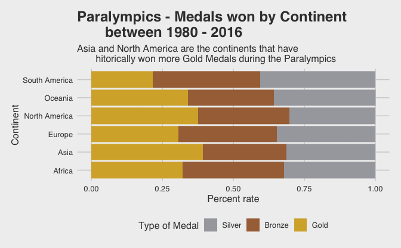

2021 W 32 TidyTuesday - Paralympics
================
Paula Munoz
08/08/2021

## 2021: Week 32 - Paralympics

Challenge by @R4DScommunity

Challenge Link:
<https://github.com/rfordatascience/tidytuesday/tree/master/data/2021/2021-08-03>.

Data Source: <https://db.ipc-services.org/sdms/hira/web/index>

### DETAILS

Data webscraped for the games of 1980 - 2016 for the athletes for all of
their listed sports. There are additional summary-level datasets for
medals by country/sport etc that are also available on the site.

## LOADING LIBRARIES

``` r
library(tidyverse)
library(skimr)
library(knitr)
library(tidyquant)
library(rvest)
library(ggthemes)
```

## IMPORTING DATA

Importing data from Github Repository

``` r
athletes <- readr::read_csv('https://raw.githubusercontent.com/rfordatascience/tidytuesday/master/data/2021/2021-08-03/athletes.csv')
```

    ## 
    ## ── Column specification ────────────────────────────────────────────────────────
    ## cols(
    ##   gender = col_character(),
    ##   event = col_character(),
    ##   medal = col_character(),
    ##   athlete = col_character(),
    ##   abb = col_character(),
    ##   country = col_character(),
    ##   grp_id = col_double(),
    ##   type = col_character(),
    ##   year = col_double(),
    ##   guide = col_logical()
    ## )

    ## Warning: 53 parsing failures.
    ##  row   col           expected       actual                                                                                                     file
    ## 7548 guide 1/0/T/F/TRUE/FALSE AVERY Jerome 'https://raw.githubusercontent.com/rfordatascience/tidytuesday/master/data/2021/2021-08-03/athletes.csv'
    ## 7549 guide 1/0/T/F/TRUE/FALSE SILVA Celio  'https://raw.githubusercontent.com/rfordatascience/tidytuesday/master/data/2021/2021-08-03/athletes.csv'
    ## 7550 guide 1/0/T/F/TRUE/FALSE TJIVIJU Even 'https://raw.githubusercontent.com/rfordatascience/tidytuesday/master/data/2021/2021-08-03/athletes.csv'
    ## 7595 guide 1/0/T/F/TRUE/FALSE TJIVIJU Even 'https://raw.githubusercontent.com/rfordatascience/tidytuesday/master/data/2021/2021-08-03/athletes.csv'
    ## 7596 guide 1/0/T/F/TRUE/FALSE SILVA Jonas  'https://raw.githubusercontent.com/rfordatascience/tidytuesday/master/data/2021/2021-08-03/athletes.csv'
    ## .... ..... .................. ............ ........................................................................................................
    ## See problems(...) for more details.

## INSPECTING DATA

-   Inspecting first five rows:

``` r
athletes %>%
  head() %>%
  kable()
```

| gender | event                        | medal  | athlete        | abb | country | grp\_id | type    | year | guide |
|:-------|:-----------------------------|:-------|:---------------|:----|:--------|--------:|:--------|-----:|:------|
| Men    | Double FITA Round Amputee    | Gold   | LARSEN Finn    | DEN | NA      |      NA | Archery | 1980 | NA    |
| Men    | Double FITA Round Amputee    | Silver | BRENNE Manfred | FRG | NA      |      NA | Archery | 1980 | NA    |
| Men    | Double FITA Round Amputee    | Bronze | SATO Masao     | JPN | NA      |      NA | Archery | 1980 | NA    |
| Men    | Double FITA Round Paraplegic | Gold   | GEISS H.       | FRG | NA      |      NA | Archery | 1980 | NA    |
| Men    | Double FITA Round Paraplegic | Silver | GRUN Guy       | BEL | NA      |      NA | Archery | 1980 | NA    |
| Men    | Double FITA Round Paraplegic | Bronze | BUCHANAN J.    | GBR | NA      |      NA | Archery | 1980 | NA    |

-   Detailed summary:

``` r
athletes %>%
  skim()
```

|                                                  |            |
|:-------------------------------------------------|:-----------|
| Name                                             | Piped data |
| Number of rows                                   | 19547      |
| Number of columns                                | 10         |
| \_\_\_\_\_\_\_\_\_\_\_\_\_\_\_\_\_\_\_\_\_\_\_   |            |
| Column type frequency:                           |            |
| character                                        | 7          |
| logical                                          | 1          |
| numeric                                          | 2          |
| \_\_\_\_\_\_\_\_\_\_\_\_\_\_\_\_\_\_\_\_\_\_\_\_ |            |
| Group variables                                  | None       |

Data summary

**Variable type: character**

| skim\_variable | n\_missing | complete\_rate | min | max | empty | n\_unique | whitespace |
|:---------------|-----------:|---------------:|----:|----:|------:|----------:|-----------:|
| gender         |        144 |           0.99 |   3 |   5 |     0 |         3 |          0 |
| event          |          0 |           1.00 |   3 |  40 |     0 |      1670 |          0 |
| medal          |          0 |           1.00 |   4 |   6 |     0 |         3 |          0 |
| athlete        |        435 |           0.98 |   1 |  44 |     0 |      6779 |          0 |
| abb            |         49 |           1.00 |   1 |   3 |     0 |       117 |          0 |
| country        |      14428 |           0.26 |   1 |  24 |     0 |       137 |          0 |
| type           |          0 |           1.00 |   5 |  17 |     0 |        11 |          0 |

**Variable type: logical**

| skim\_variable | n\_missing | complete\_rate | mean | count |
|:---------------|-----------:|---------------:|-----:|:------|
| guide          |      19547 |              0 |  NaN | :     |

**Variable type: numeric**

| skim\_variable | n\_missing | complete\_rate |    mean |    sd |   p0 |  p25 |  p50 |  p75 | p100 | hist  |
|:---------------|-----------:|---------------:|--------:|------:|-----:|-----:|-----:|-----:|-----:|:------|
| grp\_id        |      14428 |           0.26 |    3.42 |  3.08 |    1 |    1 |    2 |    4 |   24 | ▇▁▁▁▁ |
| year           |          0 |           1.00 | 1996.72 | 11.30 | 1980 | 1988 | 1996 | 2008 | 2016 | ▇▇▇▆▆ |

-   Glimpse data:

``` r
athletes %>%
  glimpse()
```

    ## Rows: 19,547
    ## Columns: 10
    ## $ gender  <chr> "Men", "Men", "Men", "Men", "Men", "Men", "Men", "Men", "Men",…
    ## $ event   <chr> "Double FITA Round Amputee", "Double FITA Round Amputee", "Dou…
    ## $ medal   <chr> "Gold", "Silver", "Bronze", "Gold", "Silver", "Bronze", "Gold"…
    ## $ athlete <chr> "LARSEN Finn", "BRENNE Manfred", "SATO Masao", "GEISS H.", "GR…
    ## $ abb     <chr> "DEN", "FRG", "JPN", "FRG", "BEL", "GBR", "CAN", "NOR", "FRA",…
    ## $ country <chr> NA, NA, NA, NA, NA, NA, NA, NA, NA, NA, NA, NA, NA, NA, NA, NA…
    ## $ grp_id  <dbl> NA, NA, NA, NA, NA, NA, NA, NA, NA, NA, NA, NA, NA, NA, NA, NA…
    ## $ type    <chr> "Archery", "Archery", "Archery", "Archery", "Archery", "Archer…
    ## $ year    <dbl> 1980, 1980, 1980, 1980, 1980, 1980, 1980, 1980, 1980, 1980, 19…
    ## $ guide   <lgl> NA, NA, NA, NA, NA, NA, NA, NA, NA, NA, NA, NA, NA, NA, NA, NA…

``` r
athletes  %>%
  count(country)
```

    ## # A tibble: 138 × 2
    ##    country                   n
    ##    <chr>                 <int>
    ##  1 -                        39
    ##  2 ABELS S.                  1
    ##  3 ADAMIK Malgozata          2
    ##  4 AHRENSTRAND Annelie       1
    ##  5 AKINS Missy               1
    ##  6 AMORIM Marcelo            1
    ##  7 ANDERSSON Eva             1
    ##  8 ANDERSSON Lars-Gunnar     1
    ##  9 Australia               361
    ## 10 Austria                  62
    ## # … with 128 more rows

### CLEANING SCRIPT - Provided by @R4DScommunity

To see full cleaning code go to TidyTuesday page, I’m excluding it from
here for simplicity purposes.

    ## [1] "body > div.container.bg-white.border.border-header.border-top-0.pb-3 > table > tbody > tr:nth-child(1) > td:nth-child(7) > div > a"

    ## # A tibble: 39 × 9
    ##    gender event          medal  athlete       abb   country   grp_id type   year
    ##    <chr>  <chr>          <chr>  <chr>         <chr> <chr>      <int> <chr> <dbl>
    ##  1 Men    Individual Co… Gold   DRAHONINSKY … CZE   <NA>          NA Arch…  2008
    ##  2 Men    Individual Co… Silver CAVANAGH John GBR   <NA>          NA Arch…  2008
    ##  3 Men    Individual Co… Bronze FABRY Jeff    USA   <NA>          NA Arch…  2008
    ##  4 Men    Individual Co… Gold   STUBBS John   GBR   <NA>          NA Arch…  2008
    ##  5 Men    Individual Co… Silver SIMONELLI Al… ITA   <NA>          NA Arch…  2008
    ##  6 Men    Individual Co… Bronze HORNER Phili… SUI   <NA>          NA Arch…  2008
    ##  7 Men    Individual Re… Gold   CHENG Changj… CHN   <NA>          NA Arch…  2008
    ##  8 Men    Individual Re… Silver VITALE Marco  ITA   <NA>          NA Arch…  2008
    ##  9 Men    Individual Re… Bronze TSENG Lung H… TPE   <NA>          NA Arch…  2008
    ## 10 Men    Individual Re… Gold   DAMBADONDOG … MGL   <NA>          NA Arch…  2008
    ## 11 Men    Individual Re… Silver MEUNIER Fabr… FRA   <NA>          NA Arch…  2008
    ## 12 Men    Individual Re… Bronze CHEN Yegang   CHN   <NA>          NA Arch…  2008
    ## 13 Women  Individual Co… Gold   BROWN Daniel… GBR   <NA>          NA Arch…  2008
    ## 14 Women  Individual Co… Silver KAMIYA Chieko JPN   <NA>          NA Arch…  2008
    ## 15 Women  Individual Co… Bronze CLARKE Mel    GBR   <NA>          NA Arch…  2008
    ## 16 Women  Individual Re… Gold   GIRISMEN Giz… TUR   <NA>          NA Arch…  2008
    ## 17 Women  Individual Re… Silver FU Hongzhi    CHN   <NA>          NA Arch…  2008
    ## 18 Women  Individual Re… Bronze XIAO Yanhong  CHN   <NA>          NA Arch…  2008
    ## 19 Women  Individual Re… Gold   LEE Hwa Sook  KOR   <NA>          NA Arch…  2008
    ## 20 Women  Individual Re… Silver GAO Fangxia   CHN   <NA>          NA Arch…  2008
    ## 21 Women  Individual Re… Bronze CARMICHAEL L… USA   <NA>          NA Arch…  2008
    ## 22 Men    Team Recurve … Gold   CHO Hyun Kwan KOR   Korea          1 Arch…  2008
    ## 23 Men    Team Recurve … Gold   KIM Hong Kyu  KOR   Korea          2 Arch…  2008
    ## 24 Men    Team Recurve … Gold   LEE Hong Gu   KOR   Korea          3 Arch…  2008
    ## 25 Men    Team Recurve … Silver CHEN Yegang   CHN   China          1 Arch…  2008
    ## 26 Men    Team Recurve … Silver CHENG Changj… CHN   China          2 Arch…  2008
    ## 27 Men    Team Recurve … Silver DONG Zhi      CHN   China          3 Arch…  2008
    ## 28 Men    Team Recurve … Bronze DE PELLEGRIN… ITA   Italy          1 Arch…  2008
    ## 29 Men    Team Recurve … Bronze ESPOSITO Mar… ITA   Italy          2 Arch…  2008
    ## 30 Men    Team Recurve … Bronze VITALE Marco  ITA   Italy          3 Arch…  2008
    ## 31 Women  Team Recurve … Gold   FU Hongzhi    CHN   China          1 Arch…  2008
    ## 32 Women  Team Recurve … Gold   GAO Fangxia   CHN   China          2 Arch…  2008
    ## 33 Women  Team Recurve … Gold   XIAO Yanhong  CHN   China          3 Arch…  2008
    ## 34 Women  Team Recurve … Silver KIM Ki Hee    KOR   Korea          1 Arch…  2008
    ## 35 Women  Team Recurve … Silver KIM Ran Sook  KOR   Korea          2 Arch…  2008
    ## 36 Women  Team Recurve … Silver LEE Hwa Sook  KOR   Korea          3 Arch…  2008
    ## 37 Women  Team Recurve … Bronze CERNA Mirosl… CZE   Czech Re…      1 Arch…  2008
    ## 38 Women  Team Recurve … Bronze KUNCOVA Lenka CZE   Czech Re…      2 Arch…  2008
    ## 39 Women  Team Recurve … Bronze SIDKOVA Mark… CZE   Czech Re…      3 Arch…  2008

    ## # A tibble: 26 × 10
    ##    gender event        medal  athlete   abb   guide country   grp_id type   year
    ##    <chr>  <chr>        <chr>  <chr>     <chr> <chr> <chr>      <int> <chr> <dbl>
    ##  1 Men    4x60 m 1A-1C Gold   "DE LAS … MEX   <NA>  Mexico         1 Athl…  1980
    ##  2 Men    4x60 m 1A-1C Gold   "GRANADO… MEX   <NA>  Mexico         2 Athl…  1980
    ##  3 Men    4x60 m 1A-1C Gold   "MONSALV… MEX   <NA>  Mexico         3 Athl…  1980
    ##  4 Men    4x60 m 1A-1C Gold   "SANDOVA… MEX   <NA>  Mexico         4 Athl…  1980
    ##  5 Men    4x60 m 1A-1C Silver "LEWELLY… USA   <NA>  United S…      1 Athl…  1980
    ##  6 Men    4x60 m 1A-1C Silver "SLUPE G… USA   <NA>  United S…      2 Athl…  1980
    ##  7 Men    4x60 m 1A-1C Silver "THORN J… USA   <NA>  United S…      3 Athl…  1980
    ##  8 Men    4x60 m 1A-1C Silver "WALLEN … USA   <NA>  United S…      4 Athl…  1980
    ##  9 Men    4x60 m 1A-1C Bronze "NIEHOF … NED   <NA>  Netherla…      1 Athl…  1980
    ## 10 Men    4x60 m 1A-1C Bronze "SLIJKER… NED   <NA>  Netherla…      2 Athl…  1980
    ## 11 Men    4x60 m 1A-1C Bronze "SMIT J.… NED   <NA>  Netherla…      3 Athl…  1980
    ## 12 Men    4x60 m 1A-1C Bronze "VAN DER… NED   <NA>  Netherla…      4 Athl…  1980
    ## 13 Women  4x60 m 1A-1C Gold   ""        USA   <NA>  United S…      1 Athl…  1980
    ## 14 Women  4x60 m CP C  Gold   ""        USA   <NA>  United S…      1 Athl…  1980
    ## 15 Women  4x60 m 2-5   Gold   "GARCIA … MEX   <NA>  Mexico         1 Athl…  1980
    ## 16 Women  4x60 m 2-5   Gold   "CAMARA … MEX   <NA>  Mexico         2 Athl…  1980
    ## 17 Women  4x60 m 2-5   Gold   "SOTO Ju… MEX   <NA>  Mexico         3 Athl…  1980
    ## 18 Women  4x60 m 2-5   Gold   "VALDEZ … MEX   <NA>  Mexico         4 Athl…  1980
    ## 19 Women  4x60 m 2-5   Silver "CABLE C… USA   <NA>  United S…      1 Athl…  1980
    ## 20 Women  4x60 m 2-5   Silver "CARLTON… USA   <NA>  United S…      2 Athl…  1980
    ## 21 Women  4x60 m 2-5   Silver "CASPER … USA   <NA>  United S…      3 Athl…  1980
    ## 22 Women  4x60 m 2-5   Silver "RAHN Sh… USA   <NA>  United S…      4 Athl…  1980
    ## 23 Women  4x60 m 2-5   Bronze "HAGENLO… FRG   <NA>  FR Germa…      1 Athl…  1980
    ## 24 Women  4x60 m 2-5   Bronze "MARKLEI… FRG   <NA>  FR Germa…      2 Athl…  1980
    ## 25 Women  4x60 m 2-5   Bronze "ROELLI … FRG   <NA>  FR Germa…      3 Athl…  1980
    ## 26 Women  4x60 m 2-5   Bronze "ZEYHER … FRG   <NA>  FR Germa…      4 Athl…  1980

    ## # A tibble: 16 × 7
    ##    gender event    medal  athlete           abb    year type        
    ##    <chr>  <chr>    <chr>  <chr>             <chr> <dbl> <chr>       
    ##  1 Men    -52 kg   Gold   DORE Alfred       USA    1984 Powerlifting
    ##  2 Men    -52 kg   Silver GRIFFIN Anthony   GBR    1984 Powerlifting
    ##  3 Men    -60 kg   Gold   HOULE Dean        USA    1984 Powerlifting
    ##  4 Men    -67.5 kg Gold   ABALAIN Michel    FRA    1984 Powerlifting
    ##  5 Men    -75 kg   Gold   OMAN Jonas        SWE    1984 Powerlifting
    ##  6 Men    -75 kg   Silver DIXON Juan        USA    1984 Powerlifting
    ##  7 Men    -75 kg   Bronze BELL Keith        GBR    1984 Powerlifting
    ##  8 Men    -82.5 kg Gold   ISAKSSON Roland   SWE    1984 Powerlifting
    ##  9 Men    -82.5 kg Silver SLATER Al         CAN    1984 Powerlifting
    ## 10 Men    -82.5 kg Bronze BECKE Tom         USA    1984 Powerlifting
    ## 11 Men    -90 kg   Gold   HARDY Daniel      FRA    1984 Powerlifting
    ## 12 Men    -90 kg   Silver VENDETTI Gino     CAN    1984 Powerlifting
    ## 13 Men    +90 kg   Gold   REID Charles      USA    1984 Powerlifting
    ## 14 Men    +90 kg   Silver ATTENEDER Manfred AUT    1984 Powerlifting
    ## 15 Men    -60 kg   Silver MENAGE Didier     FRA    1984 Powerlifting
    ## 16 Men    -60 kg   Silver FRAFORNET Patrick FRA    1984 Powerlifting

|                                                  |            |
|:-------------------------------------------------|:-----------|
| Name                                             | Piped data |
| Number of rows                                   | 19552      |
| Number of columns                                | 10         |
| \_\_\_\_\_\_\_\_\_\_\_\_\_\_\_\_\_\_\_\_\_\_\_   |            |
| Column type frequency:                           |            |
| character                                        | 8          |
| numeric                                          | 2          |
| \_\_\_\_\_\_\_\_\_\_\_\_\_\_\_\_\_\_\_\_\_\_\_\_ |            |
| Group variables                                  | None       |

Data summary

**Variable type: character**

| skim\_variable | n\_missing | complete\_rate | min | max | empty | n\_unique | whitespace |
|:---------------|-----------:|---------------:|----:|----:|------:|----------:|-----------:|
| gender         |        144 |           0.99 |   3 |   5 |     0 |         3 |          0 |
| event          |          0 |           1.00 |   3 |  40 |     0 |      1670 |          0 |
| medal          |          0 |           1.00 |   4 |   6 |     0 |         3 |          0 |
| athlete        |         50 |           1.00 |   0 |  44 |   385 |      6779 |          0 |
| abb            |         49 |           1.00 |   1 |   3 |     0 |       117 |          0 |
| country        |      14428 |           0.26 |   1 |  24 |     0 |       137 |          0 |
| type           |          0 |           1.00 |   5 |  17 |     0 |        11 |          0 |
| guide          |      19499 |           0.00 |   8 |  39 |     0 |        42 |          0 |

**Variable type: numeric**

| skim\_variable | n\_missing | complete\_rate |    mean |    sd |   p0 |  p25 |  p50 |  p75 | p100 | hist  |
|:---------------|-----------:|---------------:|--------:|------:|-----:|-----:|-----:|-----:|-----:|:------|
| grp\_id        |      14428 |           0.26 |    3.42 |  3.08 |    1 |    1 |    2 |    4 |   24 | ▇▁▁▁▁ |
| year           |          0 |           1.00 | 1996.72 | 11.30 | 1980 | 1988 | 1996 | 2008 | 2016 | ▇▇▇▆▆ |

    ## # A tibble: 0 × 2
    ## # … with 2 variables: type <chr>, year <dbl>

``` r
all_sports %>%
  glimpse()
```

    ## Rows: 19,552
    ## Columns: 10
    ## $ gender  <chr> "Men", "Men", "Men", "Men", "Men", "Men", "Men", "Men", "Men",…
    ## $ event   <chr> "Double FITA Round Amputee", "Double FITA Round Amputee", "Dou…
    ## $ medal   <chr> "Gold", "Silver", "Bronze", "Gold", "Silver", "Bronze", "Gold"…
    ## $ athlete <chr> "LARSEN Finn", "BRENNE Manfred", "SATO Masao", "GEISS H.", "GR…
    ## $ abb     <chr> "DEN", "FRG", "JPN", "FRG", "BEL", "GBR", "CAN", "NOR", "FRA",…
    ## $ country <chr> NA, NA, NA, NA, NA, NA, NA, NA, NA, NA, NA, NA, NA, NA, NA, NA…
    ## $ grp_id  <int> NA, NA, NA, NA, NA, NA, NA, NA, NA, NA, NA, NA, NA, NA, NA, NA…
    ## $ type    <chr> "Archery", "Archery", "Archery", "Archery", "Archery", "Archer…
    ## $ year    <dbl> 1980, 1980, 1980, 1980, 1980, 1980, 1980, 1980, 1980, 1980, 19…
    ## $ guide   <chr> NA, NA, NA, NA, NA, NA, NA, NA, NA, NA, NA, NA, NA, NA, NA, NA…

## DATA WRANGLING

### 1. Selecting columns of interest and summarizing

``` r
tidy_data <- all_sports %>%
  group_by(abb, medal) %>%
  summarise(count_medals = n()) %>%
  filter(abb != "-") %>%
  ungroup()
```

    ## `summarise()` has grouped output by 'abb'. You can override using the `.groups` argument.

``` r
tidy_data%>%
  head(10) %>%
  kable()
```

| abb | medal  | count\_medals |
|:----|:-------|--------------:|
| ALG | Bronze |            27 |
| ALG | Gold   |            20 |
| ALG | Silver |            18 |
| ANG | Bronze |             1 |
| ANG | Gold   |             4 |
| ANG | Silver |             3 |
| ARG | Bronze |            21 |
| ARG | Gold   |             8 |
| ARG | Silver |            22 |
| AUS | Bronze |           336 |

### 2. Importing dataset breaking down Country by Continent

I would like to visulize medals won by continent, since continent is not
part of original dataset, I searched for a dataset to complement my
data.

Source of data including Country and Continent list:
<https://datahub.io/JohnSnowLabs/country-and-continent-codes-list>

``` r
continent_Country <- read_csv("continent_country.csv") %>%
   select(Continent_Name, Country_Name, Three_Letter_Country_Code)
```

    ## 
    ## ── Column specification ────────────────────────────────────────────────────────
    ## cols(
    ##   Continent_Name = col_character(),
    ##   Continent_Code = col_character(),
    ##   Country_Name = col_character(),
    ##   Two_Letter_Country_Code = col_character(),
    ##   Three_Letter_Country_Code = col_character(),
    ##   Country_Number = col_double()
    ## )

``` r
continent_Country %>%
  head() %>%
  kable()
```

| Continent\_Name | Country\_Name                                | Three\_Letter\_Country\_Code |
|:----------------|:---------------------------------------------|:-----------------------------|
| Asia            | Afghanistan, Islamic Republic of             | AFG                          |
| Europe          | Albania, Republic of                         | ALB                          |
| Antarctica      | Antarctica (the territory South of 60 deg S) | ATA                          |
| Africa          | Algeria, People’s Democratic Republic of     | DZA                          |
| Oceania         | American Samoa                               | ASM                          |
| Europe          | Andorra, Principality of                     | AND                          |

### 3. Join sports tidy data with continent\_Country

``` r
tidy_data_continent <- tidy_data %>%
  left_join(continent_Country, by = c("abb" = "Three_Letter_Country_Code") ) %>%
  filter(Continent_Name != " ")

tidy_data_continent  %>%
  head() %>%
  kable()
```

| abb | medal  | count\_medals | Continent\_Name | Country\_Name                 |
|:----|:-------|--------------:|:----------------|:------------------------------|
| ARG | Bronze |            21 | South America   | Argentina, Argentine Republic |
| ARG | Gold   |             8 | South America   | Argentina, Argentine Republic |
| ARG | Silver |            22 | South America   | Argentina, Argentine Republic |
| AUS | Bronze |           336 | Oceania         | Australia, Commonwealth of    |
| AUS | Gold   |           361 | Oceania         | Australia, Commonwealth of    |
| AUS | Silver |           403 | Oceania         | Australia, Commonwealth of    |

### 2. Create stacked bar

``` r
level_order <- factor(tidy_data_continent$medal, level = c("Silver", "Bronze", "Gold"))

ggplot(tidy_data_continent, aes(fill=level_order, y=count_medals, x=Continent_Name)) +
  geom_bar(position="fill", stat = "identity") + coord_flip() +
  scale_fill_manual(values = c(
    "Bronze" = "#A77044",
    "Gold" = "#D6AF36",
    "Silver" = "#A7A7AD"
  ))  + 
  labs(title = "Paralympics - Medals won by Continent 
       between 1980 - 2016", 
       subtitle = "Asia and North America are the continents that have 
       hitorically won more Gold Medals during the Paralympics",
    y = "Percent rate", 
    x = "Continent", 
    fill = "Type of Medal"
    )  +
  theme_fivethirtyeight() +
  theme(axis.title = element_text() )
```

<!-- -->
